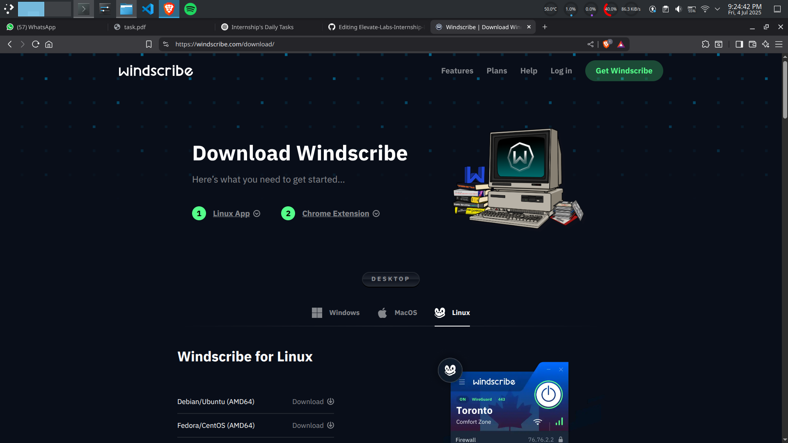
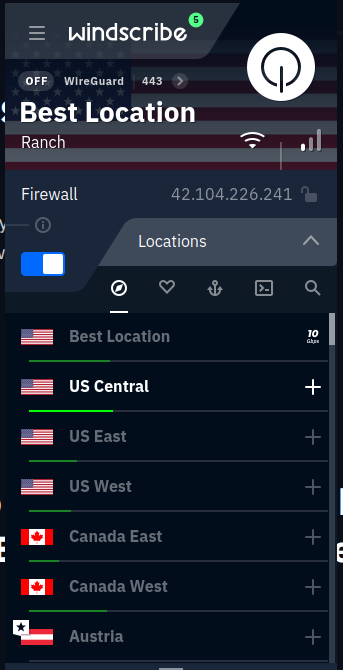
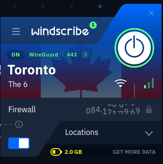
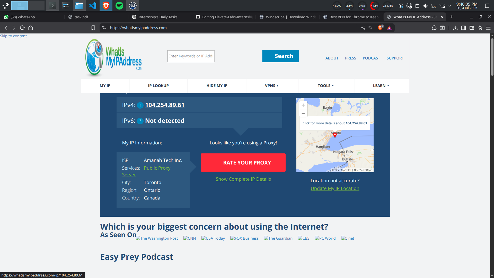
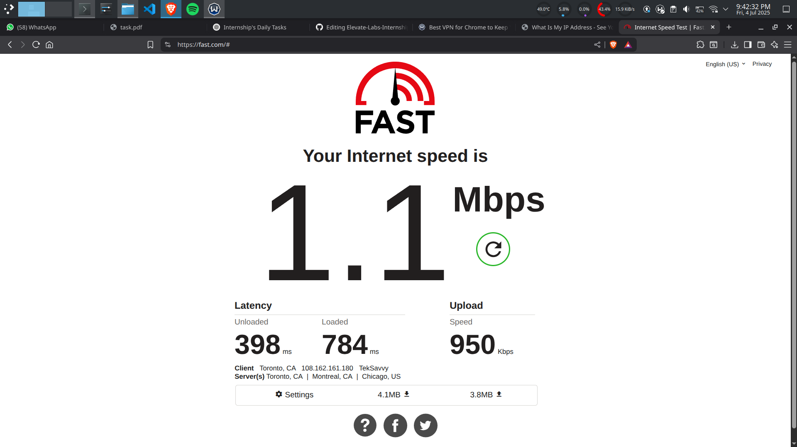
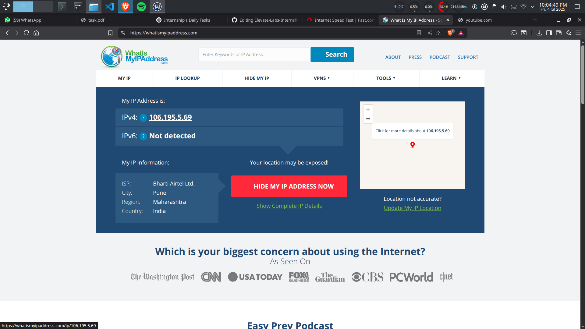
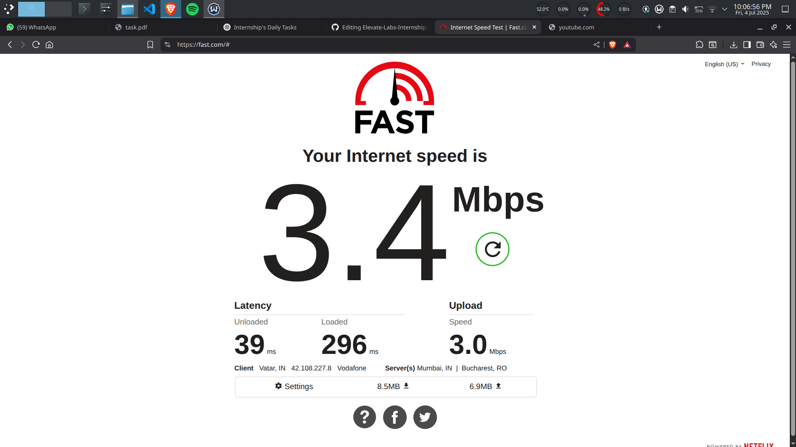
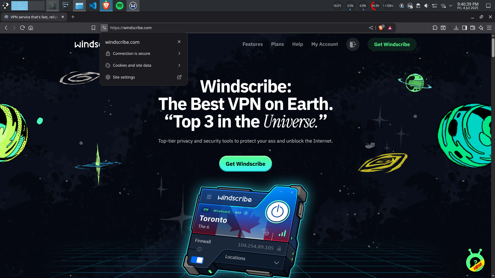

Elevate Labs Internship D08  

Task 08: Identify and Remove Suspicious Browser Extensions  

Objective: Understand the role of VPNs in protecting privacy and secure communication.  
Tools:Free VPN client (ProtonVPN free tier, Windscribe free)  
Deliverables: Report describing VPN setup steps and connection status screenshot.  

Step 1: Choose a Free VPN Service  
We will use Windscribe free

Step 2: Sign Up and Install the VPN Client  
- Create a free account
- Download the official VPN app for your OS (Windows, Linux, Mac)  

Step 3:  Connect to a VPN Server  
- Open the VPN client
- Connect to the nearest or any other country’s server
- Wait for the connection status to say “Connected”  

  

Step 4: Verify Your IP Address
- After connection:
  + IP address: 104.254.89.61
  + Location: Toronto, Canada
  + Speed: 1.1 Mbps
  

- Before connection:
  + IP address: 106.195.5.69
  + Location: Pune, India
  + Speed: 3.4 Mbps

  

Step 5. Test Encrypted Traffic  
- Visit any secure website (https://)
- Confirm browsing works normally and is encrypted (look for 🔒 lock in browser)

VPN Protocols and Features
- Uses OpenVPN and WireGuard protocols for encryption.
- Masks IP address and reroutes traffic through secure tunnel.
- Prevents ISP tracking and data logging.
- Protects data on public Wi-Fi networks.
- DNS leak protection and kill switch features are available.

Benefits:
- IP masking and location change
- Protection on public Wi-Fi
- Bypass geo-blocked sites

Limitations:
- Not foolproof anonymity
- May slow down internet speed
- Free VPNs may limit data or speed
